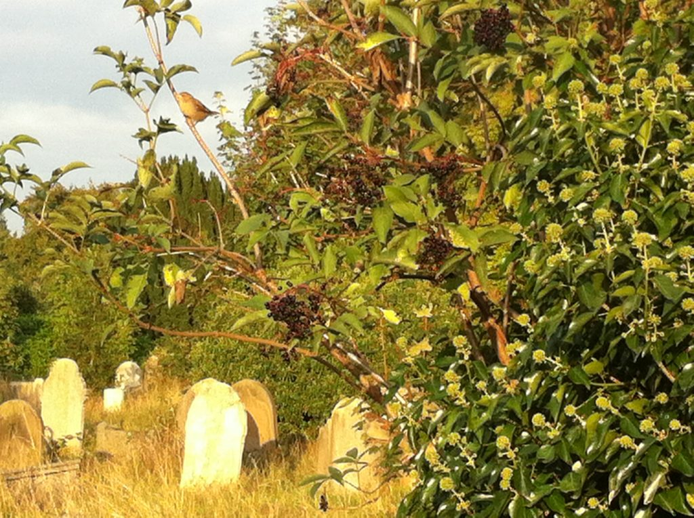

Oracle the Second: From the Head of a Demi-God
==============================================

Please return to Cambridge, to the Fitzwilliam Museum, with your smartphone (follow the directions as described at the 
start of my first post). Go to the ‘Greece and Rome’ room again, and find the large bust of Antinous which dominates the 
southern entrance to the space.

Oracle the Second will issue from this, object GR.100.1937.

Please concentrate your gaze on the sculpted head, that paragon of male beauty, on its lovely sculpted mouth. Then ask 
it a question, any question, as long as you hope the answer to it will help you to face life itself. On your phone-device, 
press the Play arrow on the audio file below. The mouth, if you look closely enough, and if you go along with my playful 
fancy, will utter its oraculations, which will make their way through your headphones into your head.

<audio controls="controls">
    <source type="audio/mpeg" src="uploads/2017/07/Two.mp3" />
     [uploads/2017/07/Two.mp3](uploads/2017/07/Two.mp3)
</audio>

You have now heard the excitedly declaimed words of Oracle the Second, and in the rest of this post I will attempt to 
interpret the oracular utterance as best I can.

The bust commemorates Emperor Hadrian’s boyfriend Antinous, who is posed as the god Dionysos. Antinous was himself 
divinized after his death by a grieving Hadrian. Jane Harrison, in her ‘Prolegomena’ which I referred to in my last post, 
goes on to describe how magician Orpheus, or his postumous cult, is credited with the protestant reformation of the savage, 
mad, drunken rites of Dionysos (the ‘drunken bull god’ in the words of the oracle) into sober, ordered rituals, in effect 
setting out the parameters for modern religion.

The new impulse that the immigrant god Dionysos brought to Greece was the belief in enthusiasm (Greek _enthousiasmós_, 
equivalent to _enthousí_: possession by a god), the belief that a man through physical intoxication at first (possibly 
influenced by agents psychedelic as well as alcoholic), then later through spiritual ecstasy, could pass from the human 
to the divine (to immortality), opening a divine communication between the MORTAL living and the dead ETERNAL. 
Shaman-artist Orpheus, always ‘more priest than musician’, claimed Harrison, took these ecstatic terrors and _articulated them_.

O Sparrow, priceless aid! My friend felt compelled to email me just before lunchtime today to tell me he had read my 
first blog post, as he said he would. He then expounded his mystery-knowledge of the Orphic rituals, some of which text 
I will gladly paste here:

> He was remembered as the reformer-priest of Dionysos, Orpheus was. Despite his Apollo sun-god crushes. And he was given 
various facets of the Dionysos myth for his own legend. (Death by dismemberment. Then return from the realm of the dead. 
See the Egyptian Osiris here – Osiris was also chopped into bits and also returned from the dead. He may be the model 
for them all.) The followers of Orpheus kept even the most bloody aspects of the Dionysian (and older) rituals. The ripping 
apart and consumption of warm ‘living’ flesh. Flesh representing the god. The superstitious practices and magic, they 
were turned by the Orpheus cult into a means for purity, as work towards godliness. With self-denial and asceticism. 
The god was no longer beyond them, on Mount Olympus, but _within them_.

Dionysos, with Orpheus as his priest, was a source-model for the deification of a later Jewish prophet – Christ. It was 
Christ who suggested that his followers theatrically but calmly consume his own body and blood ‘in memory of me’. Orpheus 
came up with this magic-cannibalism. The main Orphic gift to Christ was the need to be possessed by the god, so that man 
becomes god _now_.

Orpheus tried to ‘make sticky ecstasy work for wrong-way righteousness’ as the oracle says o’er its clattering start-stop 
drumming. Sparrow continues, in his email, with more Orphic theologico-lore, then quotes Jane Harrison: ‘Their great concern 
\[of the Orphics\] was to become divine _now_ \[Sparrow’s italics\]. That could only be attained by perfect purity. They 
did not so much seek purity that they might become divinely immortal, they needed immortality that they might become 
divinely pure.’ Life after death was hardly mentioned in their rituals; the visceral reality of _now_ is what mattered 
to them, not the future.

As Sparrow also mentions, lyrist Orpheus was the Good Shepherd (like Apollo), charming the animals with his art-charisma 
(and charming the trees, and the rocks). This must be the root of Sparrow’s special interest in shaman-bard Orpheus: 
the special appeal to the vertebrates feathered: ‘You mentioned the Siberian shamans. In your first post,’ Sparrow continued 
in his email, ‘The shaman stories and songs of the Evenks of Siberia. Their journey fictions. These are stories peopled 
with animal spirits. Spirits that assist him or her in finding the souls of the ancestors or the sick. Souls who are also 
embodied as animals of the wild. Most often birds. Orpheus the soul-charmer?’ The Evenks do indeed maintain a deep respect 
and sense of responsibility for the natural world and believe nature is a living being. Their shamanic rites are performed 
in particular places, according to Russian anthropologist M.N. Oshurkov, places where the spirits of the dead have become 
spirits of the land, _genii loci_.

Sparrow rounds off his email with the comment: ‘Soul-man Orpheus also invented the One-God. Quite a CV is it not? Look 
forward to the next post EF. Your beast-mate, Sparrow.’

A thousand thanks S, friend and helper. In the end, mine has always been an auto-education, a self-pedagogy that has lasted 
most of my 66 years on this dark globe, but it is a self-development aided by the likes of Sparrow and my other friends 
whom I call my ‘assistant spirits’, whose own self-learning has proved beyond value to me. O and not forgetting the role 
that the museums and libraries here in Cambridge have had in my enlighten-darkenment.

Any manner, enough of my own odyssey. Let me posit a conjecture. Could it be that at the moment that monotheism was born 
through song-dreamer Orpheus, and with it a new self-searching moralism and self denial, with a fatal deferral to the 
rewards of the afterlife — could it be that in the same moment the seeds of a return to a most ambivalent, most primordial 
mighty belief were also sown, a belief in the _now_life, and with it the future usurpation of the earth-defiling patriarchal 
institutions corrupt and corrupting that monotheism has produced?

As the oracle seems to be hinting, could Orpheus the lyre-bard be a model for _a new dissent_ against the accrued statutes 
of patriarchal religion and political petrification, towards the NOWLIFE-IMPULSE of real human beings and the natural world, 
towards the fearfully VITAL THING that is fateful to all that lives?

> ‘This is the place of my song-dream, the place the music played to me,’ whispered the Rat, as if in a trance. ‘Here, 
in this holy place, here if anywhere, surely we shall find Him!’ Then suddenly the Mole felt a great Awe fall upon him, 
an awe that turned his muscles to water, bowed his head, and rooted his feet to the ground. (Grahame.)

The oracle mentions a name: PERSEPHONE. Could we abandon the Law of Moses and its guardians and return to the Orphic 
force of Persephone, the bride of the cycles of life and death, the ‘Queen of Them Below’? Persephone who is three 
personas – according to Orpheus’ follower and music-thinker Pythagoras – Kore, Persephone and Demeter, personas who 
represent the successive stages of a woman’s life as Maiden, Bride and Mother, the generations eternal which spring from 
each other.

Which are all different names for the one real Great God, the Orphic PROTOGONOS (Phanes, Eros), the Life Pulse itself, 
a Greek Odin, the male-female über-daemon of Life and Death, Discord and Misrule, of blind necessities, of light and 
creation, that is beyond human, that is beyond Olympus, that is POLYMORPHIC: ‘Heads had \[s\]he many / Head of a ram, 
a bull, a snake, and a bright-eyed lion.’ (Harrison.)

Protogonos, a beast-mystery-god also called Dionysos, to whom his Bacchants cry:

> Appear, appear, whatso thy shape or name,
> 
> Mountain Bull, Snake of the Hundred Heads, Lion of the
> 
> Burning Flame!
> 
> \[And as the rousing chorus of the oracle goes\] O God, Beast, Mystery, come! (Harrison.)

_My next blog post on Tuesday will explore the All-God, those who hear his call, and who envision his horns in hushed
 twee-awe._