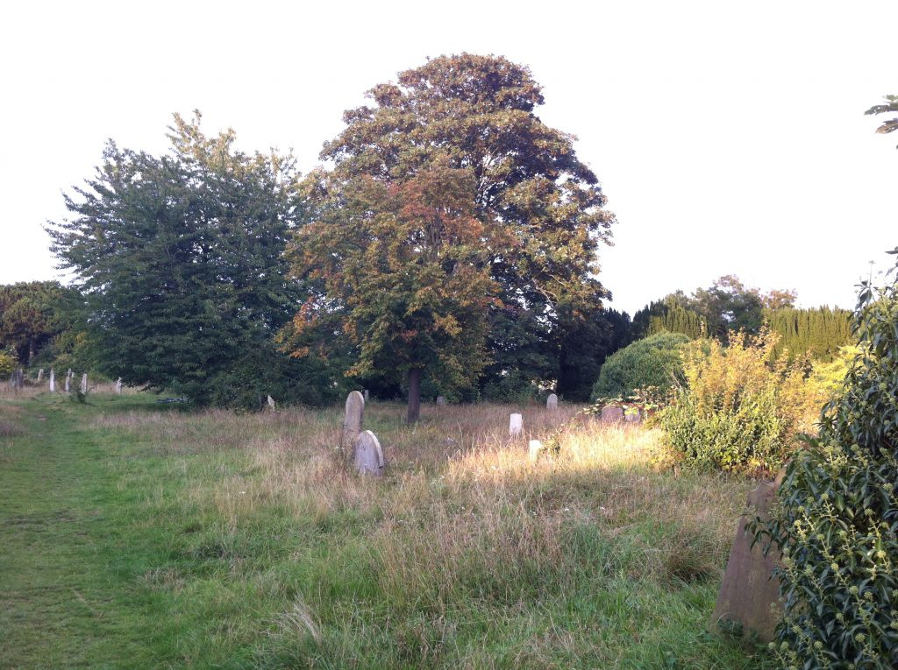

Oracle the Third: From the Head of the Great God
================================================

Please return to Cambridge, to the Fitzwilliam Museum, with your smartphone (follow the directions as described at the start of my first post). Go to the ‘Greece and Rome’ room again, and find the ‘Pashley Sarcophagus’, the large stone sarcophagus in the centre of the room.

Oracle the Third will issue from this, object GR.1.1835.

    <figure class="figure">
        
        <figcaption class="figure-caption text-info">Pashley Sarcophagus</figcaption>>
    </figure>

On the side of the sarcophagus that faces the Dionysos bust you encountered in my last post, you will see a frieze — of
Dionysos again — whose chariot is being led in procession by all and sundry. This time, there is a detail I would like 
you to focus on, the figure of Pan dancing with a drum to the left of the centre of the marble frieze. Please concentrate
your gaze on the sculpted head of Pan; on its sculpted mouth. Then ask it a question, any question, as long as you hope
the answer to it will help you to face life itself. On your phone-device, press the Play arrow on the audio file below.
The bearded mouth, if you look closely enough, and if you go along with my playful fancy, will utter its oraculations, 
which will make their way through your headphones into your head.

<audio controls="controls">
    <source type="audio/mpeg" src="uploads/2017/07/Three.mp3" />
        [uploads/2017/07/Three.mp3](uploads/2017/07/Three.mp3)
</audio>

You have now heard the words of Oracle the Third, and in the rest of this post I will attempt to interpret the oracular
utterance as best I can.

The oracle mentions Mill Road in passing, so now could be a good point to mention briefly that Mill Road Cemetery is
where I live. I sleep in one of the tombs in the St Clement area of the cemetery. There are a few of us who use the tombs
around there for shelter; it is nothing morbid I assure you. Once you learn the technique for lifting the stone lids, which
involves a wallpaper scraper, a long chisel and some little steel bars for rolling the lid across and back, then you are
all set for a dry night undisturbed. It is not where I would live if I had any choice, I can assure you of that (I will
not bore you with my Life’s Travails, or not all of them), but at least I am closer to the earth.

I saw Chiffchaff in Glisson Road earlier today. A precious mind she has. She was perched on a yellow flowered Hypericum
in the garden of number 60, Pink Floyd singer Syd Barrett’s childhood house. She said Sparrow had put her onto my blog,
that she had enjoyed the posts up to now, and did I know that Pan – of Arcadia, the ‘All-God’ – was a version of Protogonos,
a kind of popular reflection of him/her that was easier for the ancient public to grasp? I said yes, Jane Harrison had
mentioned Pan: ‘He gave a soul of life and reality to a difficult monotheistic dogma,’ wrote Harrison, ‘and the last word
was not said in Greek religion, until over the midnight sea a voice was heard crying, “Great Pan is dead.”’ If you regarded
the left end of the sarcophagus, you will have seen Pan again, looking like he is drunkenly falling out of a hammock.

Over the cello strokes and guitar dissonance of our oracle _Three_ is the phrase ‘The Golden One and the All-God’. I think
I know who the Golden One is. During lazy sylvan afternoons at Grantchester Meadows, Syd Barrett believed he had encountered
the Great God. According to Pink Floyd’s manager at the time, Andrew King: ‘He thought Pan had given him insight and
understanding into the way nature works.’

Some similar visitation must have set me on my own path towards self-betterment, though it was a connection made through
the intermediaries of my many noble friends such as Chiffchaff. I have not educated myself in order to become an archaeologist,
nor a poet, nor an anthropologist, nor even an artist. Autodidacticism tends not to confine itself to categories. Sparrow
once told me that he aspired to be, one day, a poly-myth-storian. Typically well put. I would like to similarly aspire.

Neither am I a gardener, though I have the whole of the cemetery as my garden, and have planted a good proportion of the
flowers you will see in early-summer there. _Hesperis matronalis_ or ‘Dame’s Violet’, which is Sparrow’s favourite, grow
astonishingly well by the World War I graves on the north-west cemetery path. O ye Erysimum ‘Bowles Mauve’, perennially
lovely wallflower! I have introduced them to a spot on the west cemetery wall, with a fair share of delphiniums, staples
of the local area – I saw stupendendous multitudes of both the purple and white delphinium varieties lining both banks
of the Cam near Horningsea last year. ‘The Pages’ is a rich carmine-pink variety of lupin I have added to the area around
the James Rattee Monument on the southwest wall, with some noble phlox ‘David’, one of the sovereigns of the white phloxes,
with nice bright, light green leaves. Beetle used to always remark on how they filled the whole cemetery with that
extraordinary rich and delicious scent. O my dear Petersfield heathen-Eden.

Jane Harrison’s ‘Prolegomena’ was published in 1903, and revised for the first time in 1908. I am now holding a Cambridge
Central Library copy of this second edition as I sit at an ‘accessible computer’ on the second floor. In 1908 the book
from which the following passage comes was also published, in which a water rat is enraptured by an otherworldly sound:

> ‘It’s gone!’ sighed the Rat, sinking back in his seat again. ‘So beautiful and strange and new. Since it was to end so
soon, I almost wish I had never heard it. For it has roused a longing in me that is pain, and nothing seems worthwhile
but just to hear that sound once more and go on listening to it forever. No! There it is again!’ he cried, alert once more.
Entranced, he was silent for a long space, spellbound.

This passage, like the descriptions of Orpheus charming the very rocks, is an attempt to express the transcendent power
that music can possess. It is from Kenneth Grahame’s ‘Wind in the Willows’, and it is one thing reading this story in
1908, but if you were reading it after the unexampled cataclysm of the First World War, the effect of its incantation-golden
of the music of aching rural beauty, its ‘longing in me that is pain’, must have been keenly felt. The gentle whimsy –
the tweeness, as we would now say – of the story’s confrontation with Unspeakable sublimity, seems to add to this
powerful effect rather than detract from it.

It is not the music of Orpheus that is charming these beasts and striking the birds dumb, but that of Orpheus’ god, Pan.
Mole has also felt the Indescribable, and prepares to look on the Unknowable:

> He might not refuse \[the summons\], were Death himself waiting to strike him instantly, once he had looked with mortal
eye on things rightly kept hidden. Trembling he obeyed, and raised his humble head; and then, in that utter clearness of
the imminent dawn \[…\] he looked in the very eyes of the Friend and Helper; saw the backward sweep of the curved horns,
gleaming in the growing daylight; saw the stern, hooked nose between the kindly eyes that were looking down on them
humorously, while the bearded mouth broke into a half-smile at the corners \[…\]

Is this the passage that Crow is reading (‘the sweep of the curved horns’), according to track _Three_, to Oracle the
Third? In that moment, for Mole, twee-profound fear co-exists with twee-profound love:

> ‘Rat!’ he found breath to whisper, shaking. ‘Are you afraid?’ ‘Afraid?’ murmured the Rat, his eyes shining with
unutterable love. ‘Afraid! Of Him? O, never, never! And yet – and yet – O, Mole, I am afraid!’ Then the two animals,
crouching to the earth, bowed their heads and did worship. \[…\] When they were able to look once more, the Vision had
vanished, and the air was full of the carol of birds that hailed the dawn.

Writer and psychogeographer Arthur Machen was aware of the reality behind Rat’s fear, the reality represented by the
‘symbol’ of Pan:

> We know what happened to those who chanced to meet the Great God Pan, and those who are wise to know that all the
symbols are symbols of something, not of nothing. It was, indeed an exquisite symbol beneath which men long ago veiled
their knowledge of the most awful, most secret forces which lie at the heart of all things; forces before which the
souls of men must wither and die and blacken, as their bodies blacken under the electric current. Such forces cannot be
named, cannot be spoken, cannot be imagined except under a veil and a symbol, a symbol to the most of us appearing a
quaint poetic fancy, to some a foolish tale. But you and I, at all events, have known something of the terror that may
dwell in the secret place of life, manifested under human flesh; that which is without form taking to itself a form.

Rat and his friends, and their quaint, foolish twee-tale, are merely a veil for that which cannot be imagined.

> Into my loneliness comes –
>
> The sound of a flute in dim groves that haunt the uttermost hills.
>
> Even from the brave river they reach to the edge of the wilderness.
>
> And I behold Pan.

This is not ‘Wind in the Willows’. It was published the previous year, and is the first lines of the ‘Prologue of the
Unborn’ of Liber VII (1907), by Cambridge alumnus Aleister Crowley – this must be the Aleister the oracle mentions – yet
another pan-sexual shaman-poet who returned from the dead (he faked a suicide then turned up at an exhibition of his
paintings three weeks later).

__My next [post on Friday](oracle-the-fourth-from-the-head-of-a-mouse) will feature the sunshine before the war, the stories in peril, and the Golden Boy and his bike,
riding in the sun on the hills of the giant.__
